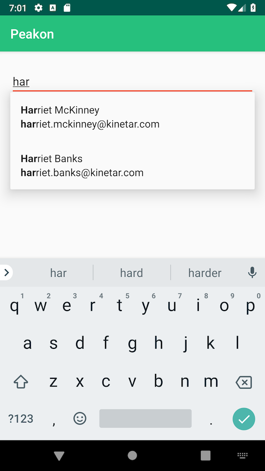
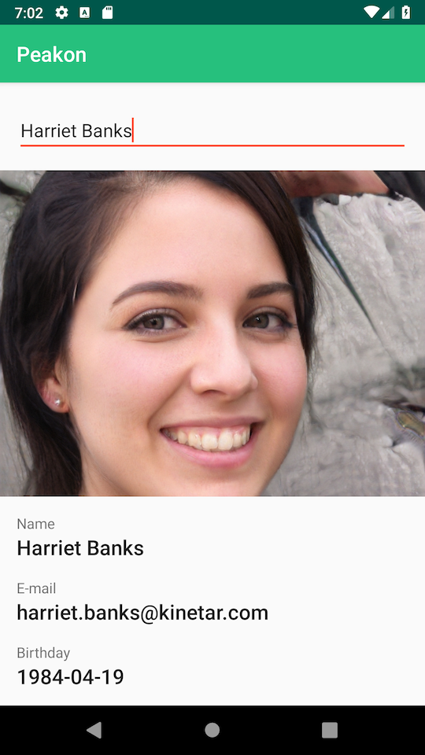

# Peakon
A simple app to search/filter Peakon employees. The collection of managers is fetched from this [gist](https://gist.github.com/daviferreira/41238222ac31fe36348544ee1d4a9a5e). There is a [possible](https://gist.github.com/daviferreira/41238222ac31fe36348544ee1d4a9a5e#gistcomment-2838959) back-end bug in the received data model as collection of employees is intermixed with accounts. The workaround strategy for this issue has been to ignore those two misplaced employees; another could have been to merge them together with the rest of the employees.

Before filtering takes place, both input and employee names and e-mails are normalized by applying [Unicode's Normalization](http://www.unicode.org/reports/tr15/tr15-23.html) and case is ignored. In the suggestion list matching strings are highlighted using **bold** font style. Once a suggestion has been selected, details of that employee are presented underneath the input field and a [face generator service](https://thispersondoesnotexist.com) is used as placeholder for missing avatar in the data collection.

|Filtering|Details|
|---|---|
|||

## Architecture


The codebase honors the MVVM-pattern encouraged by Google with the use of Android's Architecture Components. **VIEW**s observe **VIEW MODEL**s through `LiveData`. This pattern creates a clear separation of concerns and allows **VIEW MODEL**s to be easily unit tested (not done in the first release). **VIEW MODEL**s communicate with so called *repositories* for obtaining **MODEL**s from a back-end and/or a cached source. Repositories could be shared among several **VIEW MODEL**s.

### Data Binding
The Data Binding Library allows the data sources in the app to bind to UI components in the layouts using a declarative format. The bindings are generated on the fly from XML layouts. Besides reducing boilerplate code for calls such as `findViewById`, it also allows for optimized re-layouting and/or redrawing of the UI when several attributes need to be changed simultaneously.  

### Dependency Injection
With the use of Dagger2 and its specialized Android Dagger library the consumer components of utility dependencies to become agnostic to where the dependencies originate further separating the concerns between components. The pattern also allows for seamless swapping of one implementation with another in for instance testing environments.

In order for Dagger2 to correctly build a dependency tree, all dependencies need to be "touched". The `AppModule` includes an `ActivitiesModule` defines a `SubComponent` for each `Activity` in the project. Each of these `SubComponent`s in turn define their own dependents such as `Fragment`s that also want to be included in the tree. This approach allows for future modularization of the codebase into separate feature modules.

## Installation
The project can be built using Gradle.

### OS X and Linux
```
./gradlew app:clean app:assembleDebug app:installDebug
```

### Windows
```
gradlew.bat app:clean app:assembleDebug app:installDebug
```

### APK binary
1. Download the [APK](apk/app-debug.apk) to an Android device
2. Run `app-debug.apk`
3. Allow the installation to take place
4. Run the app
