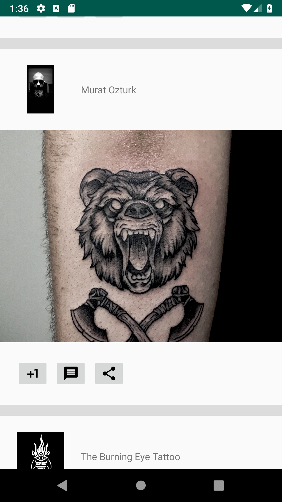

# Tattoodo
Programming assignment for Tattoodo

|Handset|Tablet| 
|---|---|
|||

## Architecture

The codebase honors the MVVM-pattern recommended by Google with the use of Android's Architecture Components. **VIEW**s observe **VIEW MODEL**s through `LiveData`. This pattern creates a clear separation of concerns and allows **VIEW MODEL**s to be easily unit tested (not done in the first release). **VIEW MODEL**s communicate with so called *repositories* for obtaining **MODEL**s from a back-end and/or a cached source. Repositories could be shared among several **VIEW MODEL**s.

### Data Binding
The Data Binding Library allows the data sources in the app to bind to UI components in the layouts using a declarative format. The bindings are generated on the fly from XML layouts. Besides reducing boilerplate code for calls such as `findViewById`, it also allows for optimized re-layouting and/or redrawing of the UI when several attributes need to be changed simultaneously.  

### Dependency Injection
With the use of Dagger2 and its specialized Android Dagger library the consumer components of utility dependencies to become agnostic to where the dependencies originate further separating the concerns between components. The pattern also allows for seamless swapping of one implementation with another in for instance testing environments.

In order for Dagger2 to correctly build a dependency tree, all dependencies need to be "touched". The `AppModule` includes an `ActivitiesModule` defines a `SubComponent` for each `Activity` in the project. Each of these `SubComponent`s in turn define their own dependents such as `Fragment`s that also want to be included in the tree. This approach allows for future modularization of the codebase into separate feature modules.

## Tablet support
The assignment is delivered with an out-of-the-box tablet support where the layout includes the detail screen next to the list of items. On handsets `MainActivity` only attaches `ListFragment` and `DetailActivity` is started upon clicking on a particular post while on tablets `MainActivity` instead replaces the right-side container with `DetailFragment`.

Classic `Fragment`->`Activity` calls are implemented using an callback-interface whom the encapsulating `Activity` may implement. In this assigment a simple `ViewModel` is used to whom item clicks in `ListFragment` are propagated. When otaining the `NavigationViewModel` `ListFragment` states that it wants to obtain the instance **of** *any* encapsulating `Activity` by passing its `Activity` into `of()`. `MainActivity` could then observe the same `ViewModel`-instance by passing `this` into `of()`.

In `MainActivity`
```
ViewModelProviders
    .of(this)
    .get(NavigationViewModel::class.java)
```

In `ListFragment`
```
ViewModelProviders
    .of(requireActivity())
    .get(NavigationViewModel::class.java)
```

Note that in order to be fully agnostic, `ListFragment` should have included a check for `if (getParent() == null)` as it could have been encapsulated by another `Fragment` rather than its `Activity`.

## Shared Element Transition
On handsets the user will notice a transition effect when moving from `MainActivity` to the `DetailFragment` of `DetailActivity` (i.e. from one `Activity` to another `Activity`'s `Fragment` which is by far the trickiest transition move to pull of) where the uploader's name, avatar and image are transitioned on to the new screen. A great effort is made to both make sure that the transition is smooth but also that the postponing and resuming of the transition is done in the same component (`DetailActivity`) to again respect the seperation of concerns.

The way this is done is the reverse of the listener-pattern mentioned in Tablet support section. The `DetailActivity` who must postpone the enter transition until the relevant `View`-components are ready (i.e. the image has been loaded or failed to load), observe the same call as its `DetailFragment` using it inside `of()`. Unless the status of the `LiveData` is `LOADING` it registers a `onPreDrawListener` who then resumes the postponed enter transition.


